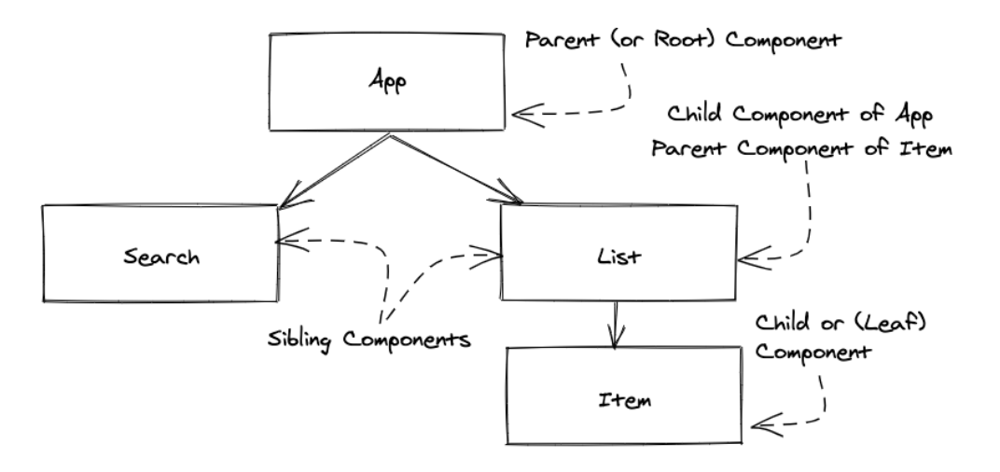

## Topic
### Hello React
> Single page application (SPA) have become increasingly popular with first-generation SPA frameworks like Angular(by Google), Ember,knockout and Backbone.

> React,yet another solution for SPAs, was released by Facebook later in 2013. All of them are used to create web application in Javascript.

>For a moment, let's go back in time before SPAs existed: In the past, websites and web application were rendered from the server. A user visits URL in a browser and requests one HTML file and all its associated HTML, CSS, and Javascript files from a web server.After some network delay, the user see the rendered HTML in browser(client) and start to interact with it.
> Every additional page transition (meaning: visiting another URL) would initiate this chain of event again.In this version from the past, essential everything crucial is done by the server, whereas the client plays a minimal role by just rendering page by page.

> In contract, modern Javascript shifted the focus from the server to the client.The most extreme version of it: A user visits a URL and request one `small HTML file` and `one larger Javascript file`.After some network delay, the user see the rendered HTML by Javascript in the browser and starts to interact with it.
> Even additional page transition wouldn't request more files from the web server, but would use the initially requested Javascript to render the new page.Also, every additional interaction by the user is handled on the client too.

> React, among the other SPA solutions, makes this possible, Essentially a SPA is one bulk of Javascript, which is neatly organized in folders and files, to create a whole application whereas the SPA framework(e.g React) gives you all the tools to architect it.
> This Javascript - focused application is delivered once over the network to your browser when a user visit the URL for your web application. From there, React or any other SPA framework, takes over for rendering everything in the browser and for dealing with user interactions.

> With the rise of React, the concept of components become popular. Every component defines it's look and feel with HTML, CSS and Javascript. Once a component is defined, it can be use in hierarchy of components for creating an entire application.Even though React has a strong focus on components as a library, the surrounding ecosystem makes it a flexible framework. React has a slim API, a stable yet thriving ecosystem.

>[how we moved from websites to web applications](https://www.robinwieruch.de/web-applications/)
>[how to learn a framework](https://www.robinwieruch.de/how-to-learn-framework/)
>[How to learn React.js](https://www.robinwieruch.de/learn-react-js/)
>[Javascript fundamentals before learning React](https://www.robinwieruch.de/javascript-fundamentals-react-requirements/)
>[API's](https://www.robinwieruch.de/what-is-an-api-javascript/)
>[How to Connect to an API with Javascript](https://www.taniarascia.com/how-to-connect-to-an-api-with-javascript/)

## Keywords && Notes
### Node and NPM
> `Node and NPM` both are used to manage libraries (node packages) that you will need along the way.Thse node packages can be libraries or whole framework. We'll install.

> You can verify node and npm versions in the command line using the `node --version` and `npm --version` commands. If you don't receive output in the terminal indicationg which version is installed you need to install node and npm:

```
Command Line
....
node --version
npm --version
```
> [npm crash course](https://www.robinwieruch.de/npm-crash-course/)

### Setting up a React Project
> In the Road to React, we'll use `create-react-app` to bootstrap your application. It's an opinionated yet zero-configuration starter kit for React introduce by Facebook in 2016.
> After installing Node and NPM, use the command line to type the following command in a dedicated folder for your projet. We'll refer to this project as `hacker-stories` but you my choose any name you like

```
Commmand Line
...

npx create-react-app hacker-stories
```
>Navigate into your new folder after the setup has finished:
```
cd hacker-stories
```
> Now we can open the application in an editor or IDE

> This is a breaknow of the most important folders and files
- `README.MD` - [Markdown] file usually displays informationabout the content contained in its repositories.
- `node_modules/:` - This folder contains all node packages that have been installed. Since we use create-react-app, a couple of node modules are alread installed. We'll not touch this folder, since node packages are usually installed and uninstalled with npm via the command line
- `package.json` - This file shows you a list of node package dependencies and other porject configuration
- `package-lock.json`: This file indicates npm how to break down all node package versions. We'll not touch this file.
- `gitignore` - This file displays all files and folders that shouldn'nt be added to your git repository when using git, asch files and foldes should be located only in your local project. The `node-module/` folder is one example.It is enough to share the `package.json` file with others, so they can install dependencies on their end with `npm install` without your entire dependency folder.
- `public/` - This folder holds development files, such as `public/index.html`.the `index file` is displayed on `localhost:3000` when the app is in development or on a domain that is hosted elsewhere. The default setup hands relating this `index.html` with all hte Javascript from `src/`.

> In the beginnning, everything you need is located in the `src/` folder. The main focus lies on the `src/App.js` file which is used to implement React components. It will be used to implement your application, but later you might want to split your componenents into multiple files,where each file maintains one or more components on its own. We will arrive at this point eventually.

> Additionally, you will find a `src/App.test.js` for your test, and a `src/index.js` as an entry point to the React World. There is also a `src/index.css` and a `src/App.css` file to style your overall application and components, which comes with the default style when you open them. You will modifty them later as well.

> After you have learned about the foler and files structure of your React project, let's go through the availabe commands to get it started.All your project-specific commands can be found in your `package.json` under the `scripts` property. 
```
  "scripts": {
    "start": "react-scripts start",
    "build": "react-scripts build",
    "test": "react-scripts test",
    "eject": "react-scripts eject"
  },
```

> These scripts are executed with the `npm run <script>` command in IDE-intergrated terminal or your standalone command line tool. The `run` can be ommited for the `start` and `test` scripts. The commands are as follows

```
#Runs the application in http://localhost:5500
npm start

#Run the tests
npm test

# Builds the application for production
npm run build
```

> Another commands from previous `npm scripts` called `eject`, essentiall this command is only there to make all the tooling and configuration from `create-react-app` accessible if you are not satisfied with the choices or if you want to change something.

> Read More
- [create-app documentation](https://github.com/facebook/create-react-app) and [getting started guide](https://create-react-app.dev/docs/getting-started/)
- [supported Javascript featurest in create-react-app](https://create-react-app.dev/docs/supported-browsers-features/)
- [the folder structure in create-react-app](https://create-react-app.dev/docs/folder-structure/)
- [scripts in create-react-app](https://create-react-app.dev/docs/available-scripts/)


### Meet the React Components
> Every React application is built on the foundation of React Component. First component which is located in the `src/App.js` file

```
import * as React from 'react';

const title = 'React';

function App() {
  return (
    <div>
      <h1>Hello World</h1>
    </div>
  );
}

export default App;
```
> Before we dive deeper into each topic
⋅⋅* First, this React component, called the App Component.
⋅⋅* Second, the App component doesn't receive any parameters in its function signature
⋅⋅* And third, the App components returns code the resembles HTML

> Variables defined in the function's body will be re-defined each time functions runs, which shouldn't be something new if you are familiar with Javascript and its functions.

```
import * as React from 'react';
function App() {
  const title = 'React';
  return (
    <div>
      <h1>Hello World</h1>
    </div>
); }
export default App;
```

### React JSX
> Everything returned from a React component will be displayed in the browser. The output of the App component not only resembles HTML, but it can also be mixed with Javascript. In fact, this output is called JSX (Javacript XML)

```
import * as React from 'react';


function App(){
  const title = 'React'
  return(
    //app component return code that resemble HTML
    <div>
      <h1>Hello {title}</h1>
    </div>
  )
}


export default App;
```

> Let's focus on the HTML which differs slightly in JSX. An HTML input field with a label can be defined as follows:

```
import * as React from 'react';

const title = 'React'
function App(){

  return(
    //app component return code that resemble HTML
    <div>
      <h1>Hello {title}</h1>

      <label htmlFor="search">Search:</label>
      <input id="search" type="text"/>
    </div>
  )
}


export default App;
```

> JSX replaces a handful of internal HTML attributes casued by internal implementation details of React itself. However, you can find all the [supported HTML attribues](https://reactjs.org/docs/dom-elements.html#all-supported-html-attributes)

```
import * as React from 'react';

const welcome = {
  greetings:'Hey',
  title: 'React'
}
function App(){

  return(
    //app component return code that resemble HTML
    <div>
      <h1>{welcome.greetings} {welcome.title}</h1>

      <label htmlFor="search">Search:</label>
      <input id="search" type="text"/>
    </div>
  )
}


export default App;
```

> Essentially everything in curly braces in JSX can be used for Javascript. For example, executing a function works this way too:

```
import * as React from 'react';

function getTitle(title){
  return title;
}
function App(){

  return(
    //app component return code that resemble HTML
    <div>
      <h1> Hello {getTitle('React')}</h1>

      <label htmlFor="search">Search:</label>
      <input id="search" type="text"/>
    </div>
  )
}

export default App;
```

> JSX was initially invented for React, but it became useful for other modern libraries and frameworks after it gained popularity. It's one of my favorite thing about React. Without any extra templating syntax (except for the curly braces), we are now able to use Javascript in HTML. 

### Lists in React
> Render a list of item and applying that knowledge to fetched data from a remote API

```
import * as React from 'react';

//defining the array as a variable
const list = [
  {
    title: 'React',
    url: 'https://react.org/',
    author: 'Jordan Walke',
    num_comments: 3,
    points: 4,
    objectID: 0
  },
  {
    title: 'Redux',
    url: 'https://redux.js.org/',
    author:'Dan Abramov, Andrew Clark',
    num_comments: 3,
    points: 5,
    objectID: 0
  }

]

function App(){
  return (
    <div>
      <h1>My Hacker Stories</h1>

      <label htmlFor="search">Search:</label>
      <input id="search" type="text"/>

      <hr/>

      {/*rendering list*/}

      <ul>
        {list.map((item)=>{
          return <li key={item.objectID}>{item.title}</li>
        })}

      </ul>
      {/*and by the way: that's how you do coments in JSX*/}
    </div>
  )
}

export default App;

```
> By assigning a key attribute to each list items element, React can identify items if the list changes (eg re-ordering). The `key` isn't necessary yet in our current situation, however, it's a best practice to use it from the start. 

> We avoid using the index of item in the array to make sure the key attributes is a stable identifier. If the list changes it's order, for example, React will not be able to identify the item properly when using the array's index.

> Using the index as identifier

```
....

const list = [
  {
    title: 'React',
    url: 'https://react.org/',
    author: 'Jordan Walke',
    num_comments: 3,
    points: 4,
    objectID: 0
  },
  {
    title: 'Redux',
    url: 'https://redux.js.org/',
    author:'Dan Abramov, Andrew Clark',
    num_comments: 3,
    points: 5,
    objectID: 0
  }

]

function App(){
  return (
    <div>
      <h1>My Hacker Stories</h1>

      <label htmlFor="search">Search:</label>
      <input id="search" type="text"/>

      <hr/>

      {/*rendering list*/}

      <ul>
       {list.map((item,index)=>{
         return <li key={index}>{item.title}</li>
       })}

      </ul>
      {/*and by the way: that's how you do coments in JSX*/}

    </div>
  )
}
```
> Experimenting with displaying more of the items's properties.

```
function App(){
  return (
    <div>
      <h1>My Hacker Stories</h1>

      <label htmlFor="search">Search:</label>
      <input id="search" type="text"/>

      <hr/>

      {/*rendering list*/}

      <ul>
        {
          list.map((item)=>{
            return (
              <li key={item.objectID}>
                <span>
                  <a href={item.url}>{item.title}</a>
                </span>
                <span>{item.author}</span>
                <span>{item.num_comments}</span>
                <span>{item.points}</span>
              </li>
              
            )
          })
        }
      </ul>
      {/*and by the way: that's how you do comments in JSX*/}
    </div>
  )
}
```
> `Lists and Keys` keys help react identiy which items have changed, are added, or are removed. Keys should be give to the elements inside the array to give the elements a stable identity;
> The best way to pick a key is to use a string that uniquely identifies a list item among its siblings. Most often you would use IDs from your data as keys
> When you don't have stable IDs for rendered items, you may use the item index as a key as last resort
> Not recommend using indexes for keys if the order of items may change. This can negatively impact performance and may cause issues with component state.
> Keys must only be unique among siblings.

### Meet another React Component
> Components are the foundation of every React application. So far we've only been using the App component.This will not end well, because components should scale with your application's size.
>So instead of making one component larger and more complex, we'll split one component into multiple components eventually.
> We'll start with a new List component which extracts functionalities from the App component.

```
import * as React from 'react';

//defining the array as a variable
const list = [
  {
    title: 'React',
    url: 'https://react.org/',
    author: 'Jordan Walke',
    num_comments: 3,
    points: 4,
    objectID: 0
  },
  {
    title: 'Redux',
    url: 'https://redux.js.org/',
    author:'Dan Abramov, Andrew Clark',
    num_comments: 3,
    points: 5,
    objectID: 0
  }

]

function App(){
  return (
    <div>
      <h1> Meet another React Component</h1>
      <hr></hr>
    </div>
   
  )
}

function List(){
  return (
    <ul>
      {
        list.map(function (item){
          return (
            <li key={item.objectID}>
              <span><a href={item.url}>{item.title}</a></span>
              <span>{item.author}</span>
              <span>{item.num_comments}</span>
              <span>{item.points}</span>
            </li>

          );
        })
      }
    </ul>
  );
}

export default App;
```

> Then the new List component can be used in the App component where we have been using the inlined functionality previously:

```
...
function App(){
  return (
    <div>
      <h1> Meet another React Component | Hacker Stories</h1>
      <hr></hr>

      <List />


    </div>
   
  )
}
...
```

> With this example in mind, we can see how components encapsulate meaningful tasks while contributing to the greater good of a larger React application. Extracting a component is a task that you will perform very often as a React developer because it's always the case that a component will grow in size and complexity. Let's do this extraction of a component one more time for a so-called Search component.

```
import * as React from 'react';

//defining the array as a variable
const list = [
  {
    title: 'React',
    url: 'https://react.org/',
    author: 'Jordan Walke',
    num_comments: 3,
    points: 4,
    objectID: 0
  },
  {
    title: 'Redux',
    url: 'https://redux.js.org/',
    author:'Dan Abramov, Andrew Clark',
    num_comments: 3,
    points: 5,
    objectID: 0
  }

]

function App(){
  return (
    <div>
      <h1> Meet another React Component | Hacker Stories</h1>
      <Search />
      <hr></hr>

      <List />


    </div>
   
  )
}

function List(){
  return (
    <ul>
      {
        list.map(function (item){
          return (
            <li key={item.objectID}>
              <span><a href={item.url}>{item.title}</a></span>
              <span>{item.author}</span>
              <span>{item.num_comments}</span>
              <span>{item.points}</span>
            </li>

          );
        })
      }
    </ul>
  );
}

function Search(){
  return(
    <div>
      <label htmlFor="search">Search:</label>
      <input id="search" type="text" />

    </div>
    
  )
}
export default App;
```
> Finally, we have three components in our application: App, List and Search. Generally speaking, a React application consists of may hierachical components; which we can put into the following categories:


> React applications have `components hierarchies` (also called component trees)
> There is usually one uppermost entry point component (e.g App) that spans a tree of components below it.
> App` is a parent component of 'List and Search`, which they are `child component`, and `sibling components` to each other.
> Components that don't render any other components are called `leaf components` (e.g List/Search) components.
> All components can have zero, one or many child components.

### React Component Instantiation
> Next, I'll be explain Javascript classes, to help clarify React components.
> Classes are most often used in object-oriented programming languages. Javascript, always flexible in its programming paradigms, allows functional programming and object-oriented programming to co-exist side-by-side.
> To recap Javascript classes for object-oriented programming,consider the following Developer class:

```
class Developer{
  constructor(firstName, lastName){
    this.firstName = firstName;
    this.lastName = lastName;
  }

  getName(){
    return this.firstName + ' ' + this.lastName;
  }
  
}

```

> Each class has a constructor that takes argument and assigns them to the class instance.
> Defining the Developer class is just one part; instantiating it is the other.
> If a Javascript class definition exists, one can create `multiple instances of it`.

```
//class definition
class Developer{ ... }

//class instantiation
const robin = new Developer('Joseph', 'Muganga')

console.log('robin.getName());
//"Joseph Muganga"

//another class instantiation
const mungi = new Developer('Mungi','Buhkay')

console.log(mungi.getName())
//"Mungi Buhkay"
```

> The concept of class definition and instantiation is similar to a React component, which also has only one component definition, but can have multiple component instances:

```
//definition of App component
function App(){
  return (
    <div>
      <h1>My Hacker Stories</h1>

      <Search />

      <hr />

      {/* creating an instance of List component */}
      <List />
      {/*creating another instance of List component*/}
      <List />

    </div>
  )
}

//definition of List component
function List() { ... }

```

> Once we've defined a component, we can use it as an HTML element anywhere in our JSX.
> The element produces a component instance of your component, or in other words, the component get instantiated.
> However, technically a `Javascript class and React component` are not the same, just their usage makes it convenient to demonstrate their similarities.

#### React Components, Elements and Instances

### React DOM
> Now that we've learned about component definitions and their instantiation, we can move to the App component's instantiation. It has been in our application from the start, in the src/index.js file.

```
src/index.js
...
import React from 'react';
import ReactDOM from 'react-dom/client';
import './index.css';
import App from './App';
import reportWebVitals from './reportWebVitals';

const root = ReactDOM.createRoot(document.getElementById('root'));
root.render(
  <React.StrictMode>
    <App />
  </React.StrictMode>
);

// If you want to start measuring performance in your app, pass a function
// to log results (for example: reportWebVitals(console.log))
// or send to an analytics endpoint. Learn more: https://bit.ly/CRA-vitals
reportWebVitals();

```
> Next to React which is imported from `react`, there is another imported library called `react-dom`, in which a `ReactDOM.render()` function uses an HTML node to replace it with JSX.
>Essentially that's everything needed to integrate React into any application which uses HTML. In more detail, ReactDOM.render() expects two arguments, the first  is to render the JSX. It creates an instance of your App component, though it can also pass simple JSX without any component instantiation:

#### [Rendering Elements](https://reactjs.org/docs/rendering-elements.html)
> Elements are the smallest building blocks of React app.
> An element describes what you want to see on the screen:

```
const element = <h1>Hello, world</h1>
```

> Elements are what components are 'made of".

##### Rendering an Element into the DOM

Let's say there is a <div> somewhere in your HTML file:

```
<div id="root"></div>
```
> We call this a "root" DOM node because everything inside it will be manged by React DOM.
> Applications build with just React usually have a single root DOM node. If you are integrating React into an existing app, you may have as many isolated root DOM nodes as you like.
> To render a React element, first pass the DOM element to React.DOM.createRoot(), then pass the React element to root.render()

```
const root = RectDOM.createRoot(document.getElementById('root'));
const element = <h1>Hello, world</h1>
root.render(element)
```

##### Updating the Render Element
> React elements are immutable. Once you create an element, you can't change it's children or attributes. An element is like a single frame in a movie: it represents the UI at a certain point in time.
> With our knowledge so far, the only way to update the UI is to create a new element, and pass it to root.render()

```
const root = ReactDOM.createRoot(document.getElementById('root'));

function tick(){
  const element = (
    <div>
        <h1>Hello, world!</h1>
        <h2>It is {new Date().toLocaleTimeString()}</h2>
    </div>
  );
  root.render(element)
}

setInterval(tick,1000)
```
> it calls root.render() every second from a setInterval() callback

##### React Only Updates What's Necessary
> React DOM compares the elements and its children to the previous one, and only applies the DOM updates necessary to bring the DOM to the desired state.

### React Component Definition (Advanced)
> Javascript has multiple ways to declare functions. So far, we have used the function statement, through arrow function can be used more concisely:

```
//function declaration
function(){...}

//arrow function declaration
const () => {...}
```

> You can remove the parentheses in an arrow function expression if it has only one argument, but multiple arguments require parentheses:

```
//allowed
const item => {}

//allowed (recommended)
const (item) => {...}

//not allowed
const ite,index => {...}

//allowed (recommended)
const (item,index) => {...}
```
> Defining React Function components with arrow functions makes them more concise:

```
src/App.js
...

const App = () =>{
  return (
    <div>

    </div>
  )
}

const Search = () =>{
  return (
    <div>
        <label htmlFor="search">Search: </label>
        <input id="search" type="text">
    </div>
  );
  }

  const List = () =>{
    return (
      ...
      </ul>
    )
  }
```

> This also holds true for other functions, like the one we used in our Javascript array's map method

```
src/App.js
...
const List = ()=>{
  return (
    <ul>
      {list.map(item)=>{
        return (
          <li key={item.objectID}>
            <span>
                <a href={item.url}>{item.title}</a>
            </span>
            <span>{item.author}</span>
            <span>{item.num_comments}</span>
            <span>{item.points}</span>

          </li>
        )
      }}
    </ul>
  )
}

```
> I an arrow function's only purpose is to return a value and it doesn't have any business login in between, you can remove the block body (curly braces) of the function. In a concise body, an implicit return statement is attached, so you can remove the return statment:

```
//with block body
const countPlusOne = (count) =>{
  //perform any task in between
  return count + 1
};

//with concise body
const countPlusOne = (count) => count + 1

//with concise body as one line
cont countPlusOne = (count) => count + 1;
```

> This can be done for the App, List and Search components as well, because they only return JSX and don't perform any task in between. Again it also applies to the arrow function that's used in the map function:

```
src/App.js
...
const App = () =>{
  <div>
  ...
  </div>
}
const Search = () =>{
  <div>
    <label htmlFor="search">Search: </label>
    <input id="search" type="text">
  </div>
}
const List = () =>{
  <ul>
  {list.map((item)=>(
    <li key={item.objectID}>
        <span>
            <a href={item.url}>{item.title}</a>
        </span>
        <span>{item.author}</span>
        <span>{item.num_comments}</span>
        <span>{item.points}</span>
    </li>
  ))}
  </ul>
}

```

> Our JSX is more concise now, as it omits the function statement, the curly braces, and the return statement.However, remember this is an optional step, and that it's acceptable to use normal function instead of arrow functions and block bodies with curly braces for arrow function over implicit returns. Sometimes block bodies will be necessary to introduce more business logic between function and return statement:

```
const App = () =>{
  //perform any task in between
  return (
    <div>
    ...
    </div>
  )
}
```

## Summary